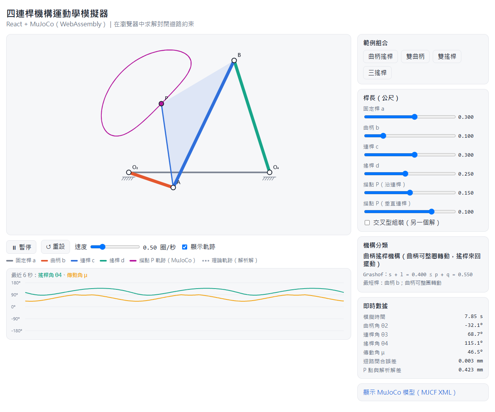

# 四連桿機構運動學模擬器（React + MuJoCo WebAssembly）

在瀏覽器中用 **MuJoCo 物理引擎（WebAssembly 版）** 模擬四連桿機構，並與解析解比對。

**線上版**：<https://gemini960114.github.io/vibe_coding_course_demo_01/fourbar-mujoco/>（推送到 `main` 時由 GitHub Actions 自動部署到 GitHub Pages）



## 功能

- 調整固定桿 a、曲柄 b、連桿 c、搖桿 d 長度，以及連桿上的描點 P 位置。
- 自動判斷 **Grashof 條件** 與機構類型（曲柄搖桿、雙曲柄、雙搖桿、三搖桿等）。
- 曲柄可整圈時等速旋轉；不能整圈時自動在可行範圍內來回擺動（避開死點）。
- 繪製描點 P 的軌跡（耦合曲線）：實線為 MuJoCo 模擬結果，虛線為解析解。
- 即時顯示 θ2、θ3、θ4、**傳動角 μ**（小於 40° 會警示）、迴路閉合誤差。
- 可切換「交叉型組裝」，觀察同一組桿長的另一個解。
- 可展開查看程式產生的 MuJoCo 模型（MJCF XML）。

## 執行

```powershell
npm install
npm run dev
```

開啟終端機顯示的網址（預設 <http://localhost:5173>）。

其他指令：

| 指令 | 用途 |
|---|---|
| `npm run verify` | 在 Node 中跑 MuJoCo，驗證四種機構的模擬結果與解析解誤差小於 0.1 mm |
| `npm run build` | 打包正式版到 `dist/` |

## 原理

| 部分 | 做法 |
|---|---|
| 解析解 | `src/fourbar.js`：曲柄端點 A 為圓心半徑 c 的圓，與 O4 為圓心半徑 d 的圓求交點得 B |
| MuJoCo 模型 | 曲柄 → 連桿為串接的鉸鏈，搖桿另外鉸接在地面；以 `<connect site1 site2>` 等式約束把連桿末端與搖桿末端接起來，形成封閉迴路 |
| 驅動 | 曲柄關節上的 `position` 伺服器追隨目標角度；重力設為 0，只看運動學 |
| 初始組裝 | 用解析解算出三個關節角作為初始 `qpos`，讓迴路在 t=0 就閉合 |

## 檔案

```text
src/
├─ fourbar.js   # 解析運動學、Grashof 判別、MJCF 產生器
├─ App.jsx      # React 介面、MuJoCo 載入與模擬迴圈、Canvas 繪圖
├─ App.css
└─ main.jsx
scripts/verify.mjs  # Node 驗證腳本
```

## 注意

- 使用官方套件 [`@mujoco/mujoco`](https://www.npmjs.com/package/@mujoco/mujoco)（Google DeepMind）。官方說明目前以 Chrome 為主要測試瀏覽器。
- `vite.config.js` 的 `optimizeDeps.exclude` 必須保留，否則開發模式下找不到 `mujoco.wasm`。
- MuJoCo 物件（`MjModel`、`MjData`）不會被 JavaScript 自動回收，重建模型時要呼叫 `.delete()`。
